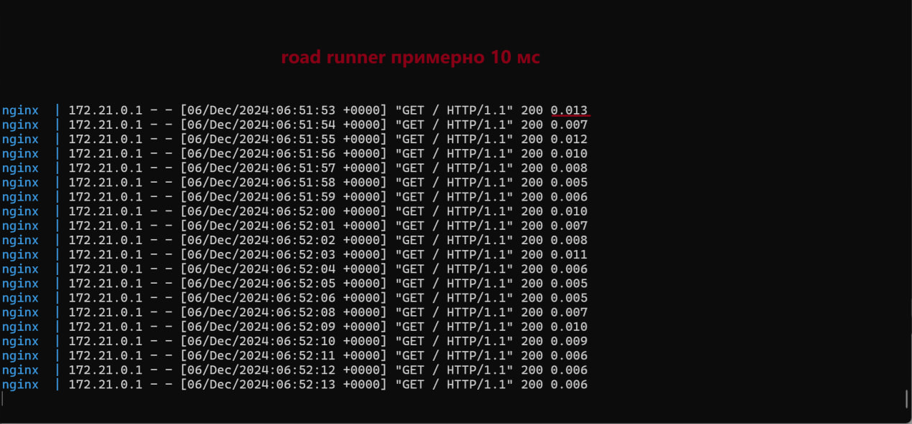

## Установка

* Скачать репозиторий
* make up
* make connect-php-fpm
* cd /app/laravel
* composer i

## Запустиь тест
* http://localhost:80 - это php-fpm
* http://localhost:81 - это php road runner
* make logs-nginx - покажет логи nginx - там время запроса в последнем столбце

## Время ответа PHP-FPM Laravel Welcome Page

## Время ответа PHP Road Runner Laravel Welcome Page

